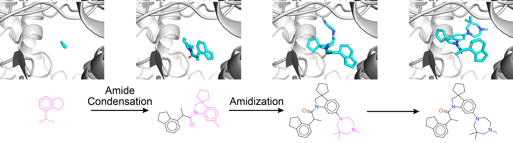
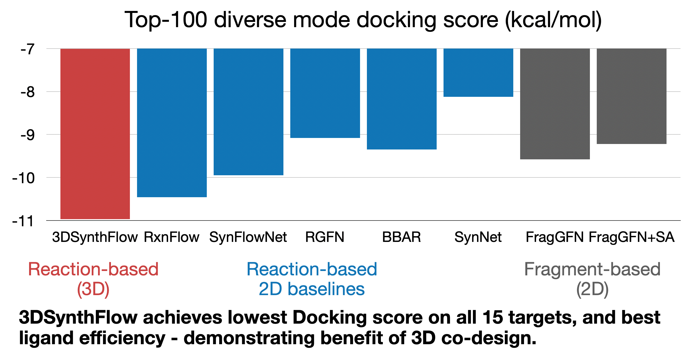

# CGFlow: Compositional Flows for 3D Molecule and Synthesis Pathway Co-design

This is the official repository of our ICML 2025 paper: **"Compositional Flows for 3D Molecule and Synthesis Pathway Co-design"**. 

**Overview:** CGFlow introduces Compositional Generative Flows, a framework extending flow matching to generate compositional objects with continuous states. We apply CGFlow to synthesizable drug design by jointly designing a molecule's synthetic pathway and its 3D binding pose. For reproducing results reported in the paper, please refer to the [submission version](https://github.com/tsa87/cgflow/releases/tag/v0-icml25-submission).

**Demo:**
We have a web app demo available: [3DSynthFlow Demo](https://3dsynthflowapp-s2d6tvz22exfsugf575jsm.streamlit.app/). This demo illustrates the types of molecules and synthesis trajectories generated by 3DSynthFlow.
The underlying model is trained in a pocket-conditional setting and is intended for demo and research purposes only. 

⚠️ For practical drug discovery applications, we strongly recommend finetuning the model on your specific protein target.



## Table of Contents

1. [Acknowledgements](#acknowledgements)
2. [Installation](#installation)
3. [Data Preparation](#data-preparation)
4. [Running Experiments](#running-experiments)
5. [License](#license)
6. [Citation](#citation)

## Acknowledgements

This project builds upon prior work including:
- [GFlowNet repository](https://github.com/recursionpharma/gflownet) by Recursion
- [RxnFlow](https://github.com/SeonghwanSeo/RxnFlow) for synthesis-based generation
- [SemlaFlow](https://github.com/rssrwn/semla-flow) for flow matching-based molecular conformation generation

## Installation

### Environment Setup

```bash
# Create and activate conda environment
conda create --name cgflow python=3.11
conda activate cgflow

# Install PyTorch and PyTorch Geometric with CUDA 12.4 support
pip install torch==2.6.0 torch-geometric>=2.4.0 torch-scatter>=2.1.2 torch-sparse>=0.6.18 torch-cluster>=1.6.3 -f https://data.pyg.org/whl/torch-2.6.0+cu124.html

# Install the package in editable mode
pip install -e .

# Install additional dependencies
conda install -c conda-forge notebook unidock_env unidock
pip install -e '.[extra]'
```

## Data Preparation

### 1. Pose Prediction Dataset

Download and prepare the preprocessed PLINDER dataset for pose prediction pretraining:

```bash
mkdir -p experiments/data/complex
cd experiments/data/complex
curl -L -o plinder_15A.zip https://figshare.com/ndownloader/files/54405473
unzip plinder_15A.zip
```

### 2. LIT-PCBA Pocket Data

```bash
cd experiments/data
curl -L -o LIT-PCBA.tar.gz https://figshare.com/ndownloader/files/54411395
tar -xzvf LIT-PCBA.tar.gz
```

### 3. Enamine Building Block Generation

#### Option A: Generate from Enamine Catalog
Use the "Comprehensive Catalog" (2024.06.10) from [Enamine](https://enamine.net/building-blocks/building-blocks-catalog):

```bash
cd experiments/data
python scripts/a_catalog_to_smi.py -b <CATALOG_SDF> -o building_blocks/enamine_catalog.smi --cpu <CPU>
python scripts/a_refine_smi.py -b building_blocks/enamine_catalog.smi -o building_blocks/enamine_blocks.smi --filter_druglike --cpu <CPU>
python scripts/b_create_env.py -b building_blocks/enamine_catalog.smi -o envs/catalog/ --cpu <CPU>
```

#### Option B: Download Prepared Files
```bash
cd experiments/data/envs
gdown https://drive.google.com/uc?id=192RuXBzM51Mk__-kSKcCs4kthnKHWAgm
tar -xzvf stock.tar.gz
```

## Running Experiments

### 1. Train General State Flow (Pose Prediction)

Train the state flow model for pose prediction:
```bash
sh scripts/A_semlaflow_train_crossdocked.sh
```
Note: This script trains pose prediction on Plinder dataset rather than the CrossDocked dataset as done in the paper experiments.
Plinder is a larger dataset, and we used unbiased pocket extraction. Therefore the pose prediction performance is improved compared to reported result.
We'll release the pretrained checkpoint for Plinder training soon.

For reproducing paper results, use pretrained model weights:
```bash
mkdir weights/
curl -L -o weights/crossdocked2020_till_end.ckpt https://figshare.com/ndownloader/files/54411752
```

### 2. Pocket-specific Optimization (LIT-PCBA)

```bash
cd experiments
wandb sweep sweep/redock.yaml
wandb agent <sweep-id>
```



### 3. Pocket-conditional Generation

#### A. Download CrossDocked Dataset
1. Get `crossdocked.tar.gz` from [here](https://drive.google.com/file/d/1BKYx_H1m-TzG_75Gk-7sjPkt5ow-Acdw/view?usp=sharing)
2. Extract dataset:
```bash
cd experiments/data/
gdown 1BKYx_H1m-TzG_75Gk-7sjPkt5ow-Acdw
tar -xzvf crossdocked.tar.gz
```

#### B. Use Pretrained Weights
Use `crossdocked2020_till_end.ckpt` for consistency.

#### C. Docking Score Proxy Setup
Follow instructions at [PharmacoNet](https://github.com/SeonghwanSeo/PharmacoNet/tree/main/src/pmnet_appl).

#### D. Run Experiment
```bash
cd experiments
python scripts/exp3A_sbdd_proxy.py
```

**Note:** Baseline methods (e.g., SynFlowNet) are provided in supplementary materials.

## License

This project is licensed under the [MIT License](./LICENSE).

## Citation

If you use this work, please cite:

### CGFlow (ICML '25)
```bibtex
@inproceedings{shen2025compositional,
  title     = {Compositional Flows for 3D Molecule and Synthesis Pathway Co-design},
  author    = {Tony Shen and Seonghwan Seo and Ross Irwin and Kieran Didi and Simon Olsson and Woo Youn Kim and Martin Ester},
  booktitle = {Proceedings of the 42nd International Conference on Machine Learning (ICML)},
  year      = {2025},
  url       = {https://openreview.net/forum?id=4aXfSLfM0Z}
}
```

### RxnFlow (ICLR '25)
```bibtex
@inproceedings{seo2025generative,
  title={Generative Flows on Synthetic Pathway for Drug Design},
  author={Seonghwan Seo and Minsu Kim and Tony Shen and Martin Ester and Jinkyoo Park and Sungsoo Ahn and Woo Youn Kim},
  booktitle={The Thirteenth International Conference on Learning Representations},
  year={2025},
  url={https://openreview.net/forum?id=pB1XSj2y4X}
}
```

### TacoGFN (TMLR '24)
```bibtex
@article{shen2024tacogfn,
  title={Taco{GFN}: Target-conditioned {GF}lowNet for Structure-based Drug Design},
  author={Tony Shen and Seonghwan Seo and Grayson Lee and Mohit Pandey and Jason R Smith and Artem Cherkasov and Woo Youn Kim and Martin Ester},
  journal={Transactions on Machine Learning Research},
  year={2024},
  url={https://openreview.net/forum?id=N8cPv95zOU}
}
```


## Instructions for Public Release
```bash
cat .gitignore > exclude.txt
echo '.git/*' >> exclude.txt
echo '.experimental/*' >> exclude.txt
rsync -av --exclude-from=exclude.txt . ../cgflow/
```

