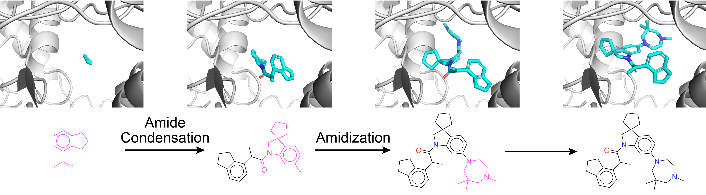

[](https://arxiv.org/abs/2504.08051)
[](LICENSE)

# CGFlow: Compositional Flows for 3D Molecule and Synthesis Pathway Co-design

This is the official repository of our ICML 2025 paper: **"Compositional Flows for 3D Molecule and Synthesis Pathway Co-design"**. This repo allows for generating candidates for custom protein targets and evaluation. For reproducing previous results reported in the paper, please refer to the [submission version](https://github.com/tsa87/cgflow/releases/tag/v0-icml25-submission).

**Overview:** CGFlow introduces Compositional Generative Flows, a framework extending flow matching to generate compositional objects with continuous states. We apply CGFlow to synthesizable drug design by jointly designing a molecule's synthetic pathway and its 3D binding pose. 

**Demo:**
We have a web app demo available: [3DSynthFlow Demo](https://3dsynthflowapp-s2d6tvz22exfsugf575jsm.streamlit.app/). This demo illustrates the types of molecules and synthesis trajectories generated by 3DSynthFlow. The app code is now available in the [app](src/app) directory.
The underlying model is trained in a pocket-conditional setting and is intended for demo purposes only - we suggest performing **pocket-specific optimization** on your custom pockets. 

**Authors:** Tony Shen*, Seonghwan Seo*, Ross Irwin, Kieran Didi, Simon Olsson, Woo Youn Kim, Martin Ester (* denotes equal contribution)



## Table of Contents

1. [Acknowledgements](#acknowledgements)
2. [Installation](#installation)
3. [Data Preparation](#data-preparation)
4. [Generation](#generation)
5. [Pretraining](#pretraining-pose-prediction-model)
6. [License](#license)
7. [Citation](#citation)

## Acknowledgements

This project builds upon prior work including:

- [GFlowNet repository](https://github.com/recursionpharma/gflownet) by Recursion
- [RxnFlow](https://github.com/SeonghwanSeo/RxnFlow) for synthesis-based generation
- [TacoGFN](https://github.com/tsa87/TacoGFN-SBDD) for target-conditioned reinforcement learning
- [SemlaFlow](https://github.com/rssrwn/semla-flow) for flow matching-based molecular conformation generation

## Installation

```bash
# Create and activate conda environment
# 1. Create and activate environment using mamba
mamba create -n cgflow python=3.11
mamba activate cgflow

# 2. Install PyTorch + PyG via pip
pip install torch==2.6.0 \
    torch-geometric>=2.4.0 \
    torch-scatter>=2.1.2 \
    torch-sparse>=0.6.18 \
    torch-cluster>=1.6.3 \
    -f https://data.pyg.org/whl/torch-2.6.0+cu124.html

# 3. Install your package (-e for editable)
pip install -e .

# 4. Install extra dependencies (optional)
# - AutoDock Vina
pip install -e '.[vina]'
# - Unidock as GPU-accelerated docking
mamba install unidock
pip install -e '.[unidock]'
# - Extras (e.g., jupyter notebook)
mamba install notebook
pip install -e '.[extra]'
```

## Data Preparation

### Download Pose Prediction Pretrained Model

You can download the pretrained model weights from [here](https://drive.google.com/drive/folders/1XjHh6VopGX48Hg7vHW3foEvrvMvUMH7C?usp=sharing)

**Pretrained model on CrossDocked2020:**
```bash
gdown --id 1xGC193o4DtSPzWFjmRIlPjmn7bLfMaCd -O ./weights/cgflow_crossdock.ckpt
```

**Pretrained model on Plinder:**
TBA

### Construct Generative environment

See [Data Preparation](data/README.md) for detailed instructions on preparing datasets and environments.

## Generating molecular candidates for protein targets

### 1. Pocket-specific Optimization
You can modify the config file to use your own protein target PDB file. By default, we train CGFlow with QED and docking score as the reward with an oracle budget of 64,000 molecules. 

#### A. GPU-accelerated UniDock (Recommended)
```bash
python scripts/opt/opt_unidock.py --config ./configs/opt/aldh1_unidock.yaml
```
In this setting, we perform Full docking, which performs a full search for the optimal binding pose, with UniDock as the reward.

#### B. AutoDock Vina (local-opt)
```bash
python scripts/opt/opt_vina.py --config ./configs/opt/aldh1_vina.yaml
```
In this setting, we directly using the final predicted pose from pose prediction model and use "local-opt" setting from AutoDock Vina to compute the reward.

### 2. Zero-shot Pocket-conditional Generation

You can download the pretrained model weights from [here](https://drive.google.com/drive/folders/1gBz-xTw6gf5nwjcB4ZPX63Y4ebGoSWkU?usp=sharing).

```bash
# Download pretrained weights
gdown --id 1xGC193o4DtSPzWFjmRIlPjmn7bLfMaCd -O ./weights/cgflow_crossdock.ckpt
gdown --id 1YC2bKy8qdUOi3ADOSJZua8_GWBM0cZEW -O ./weights/3dsynthflow_tacogfn.ckpt
```

```bash
python scripts/multi_pocket/sample.py \
  --protein_path data/examples/aldh1_protein.pdb \
  --ref_ligand_path data/examples/aldh1_ligand.mol2 \
  --env_dir "<ENV_DIR>" \
  --device cuda \
  --save_dir ./out/
```

### 3. Fine-tuning the pocket-conditional model

TBA

## Pretraining Pocket-conditional Generative Model (Research)

If you want to train the pocket-conditional generative model, you can use the following procedure.

- Download the CrossDock2020 pockets according to the instructions in the [Data Preparation](data/README.md) section.
- You can use the following command to train the model:
  ```bash
  python scripts/multi_pocket/tacogfn_proxy.py --name <PREFIX>
  ```

## Pretraining Pose Prediction Model (Research) 

If you want to train the pose prediction model, you can use the following procedure.

- Download the preprocessed data according to the instructions in the [Data Preparation](data/README.md) section.
- You can use the following command to train the model:
  ```bash
  python scripts/pretrain/train.py --name <PREFIX>
  ```


## License

This project is licensed under the [MIT License](./LICENSE).

## Citation

If you use this work, please considering citing these works which we build on:

### CGFlow (ICML '25)

```bibtex
@inproceedings{shen2025compositional,
  title     = {Compositional Flows for 3D Molecule and Synthesis Pathway Co-design},
  author    = {Tony Shen and Seonghwan Seo and Ross Irwin and Kieran Didi and Simon Olsson and Woo Youn Kim and Martin Ester},
  booktitle = {Proceedings of the 42nd International Conference on Machine Learning (ICML)},
  year      = {2025},
  url       = {https://openreview.net/forum?id=4aXfSLfM0Z}
}
```

### RxnFlow (ICLR '25)

```bibtex
@inproceedings{seo2025generative,
  title={Generative Flows on Synthetic Pathway for Drug Design},
  author={Seonghwan Seo and Minsu Kim and Tony Shen and Martin Ester and Jinkyoo Park and Sungsoo Ahn and Woo Youn Kim},
  booktitle={The Thirteenth International Conference on Learning Representations},
  year={2025},
  url={https://openreview.net/forum?id=pB1XSj2y4X}
}
```

### TacoGFN (TMLR '24)

```bibtex
@article{shen2024tacogfn,
  title={Taco{GFN}: Target-conditioned {GF}lowNet for Structure-based Drug Design},
  author={Tony Shen and Seonghwan Seo and Grayson Lee and Mohit Pandey and Jason R Smith and Artem Cherkasov and Woo Youn Kim and Martin Ester},
  journal={Transactions on Machine Learning Research},
  year={2024},
  url={https://openreview.net/forum?id=N8cPv95zOU}
}
```
